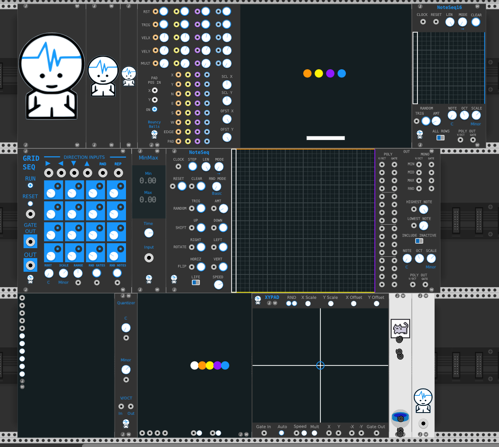

# JW-modules_Darktheme

This repo ccontains only the darkgray colored SVG files for the JW Modules plugin, for VCV Rack 1.x

These edits are not maintained nor supported by JW.

To use these files simply unzip res_dark.zip to your JW Modules plugin folder,
rename the folder that is called "res" to "res_backup".
Then rename the unzipped folder "res_dark" to "res".

This should work as there is nothing changed in the functionality of the plugin. 
If you run into problems or aren't sure of what you have done, simply delete the entire JW Modules plugin folder from the VCV plugin v1 folder.
And sync the plugins from within VCV to re-download JW Modules. 

